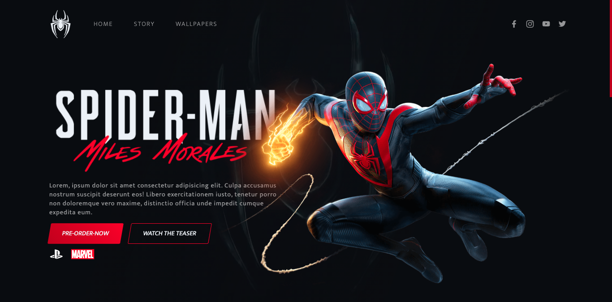

 
<br />

<h1 align="center"><b>Spider Man Miles Morales</b></h1>

<p align="center">
 <a href="#-sobre-o-projeto">Sobre</a> •
 <a href="#-demonstracao">Demonstração</a> •
 <a href="#-como-executar-o-projeto">Como executar</a> • 
 <a href="#tecnologias">Tecnologias</a> • 
 <a href="#licenc-a">Licença</a> • 
 <a href="#autor">Autor</a>
</p><br />

<h4 align="center"> 
	✅ &nbsp; Status do projeto: <b>Concluído</b> &nbsp;✅ 
</h4><br />

## **💻 Sobre o projeto**

O projeto foi desenvolvido em um evento chamado **FrontWeek**, feito pelo <a href="https://github.com/nyousefali">Násser</a> e depois continuado por mim, com o intuito de aprimorar as habilidades em html, Sass, js e bibliotecas de animações jquery. 

O tema escolhido para o projeto foi sobre o jogo do homem-aranha, chamado Spider-Man: Miles Morales.<br /><br />

--- 

## **👀 Demonstração**

<br /><br /><br />

---
## **🚀 Como executar o projeto**

Antes de começar, você vai precisar ter instalado em sua máquina a ferramenta **Git** para poder clonar o projeto em seu computador. 

```bash

# Clone este repositório
$ git clone https://github.com/N1ck-gif/Spider-Man-Miles-Morales.git

```
Após isso, basta abrir o arquivo **index.html** para iniciar o projeto.<br /><br />

---


## **🛠 Tecnologias**
As seguintes ferramentas foram usadas na construção do projeto:

&nbsp; Estilos:
- [Sass](https://sass-lang.com/)

&nbsp; Animações:

- [Jquery](https://jquery.com/)
- [Tilt.js](https://gijsroge.github.io/tilt.js/)
- [GSAP](https://greensock.com/gsap/)

&nbsp; Carousel:

- [Slick Carousel](https://kenwheeler.github.io/slick/)<br /><br />

---

## 👨🏽‍💻 Autor

<a>
 
 <br />
 <sub><b>Nicolas Santos</b></sub></a> <a>🚀</a>
 <br />

[](https://www.linkedin.com/in/nicolas-santos-487bb81ba/) 
[](mailto:ns5077900@gmail.com)
<br /><br />

---
